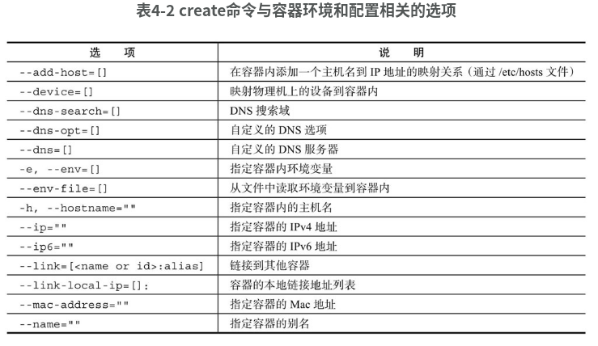
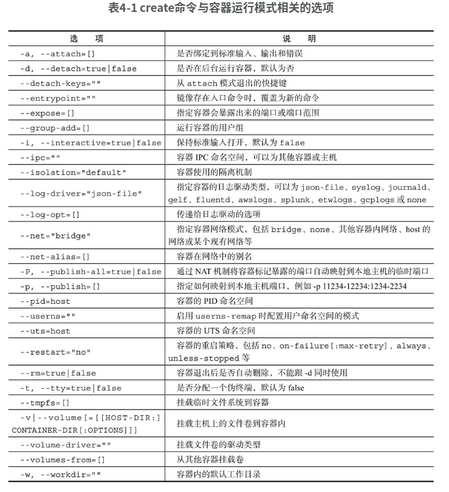
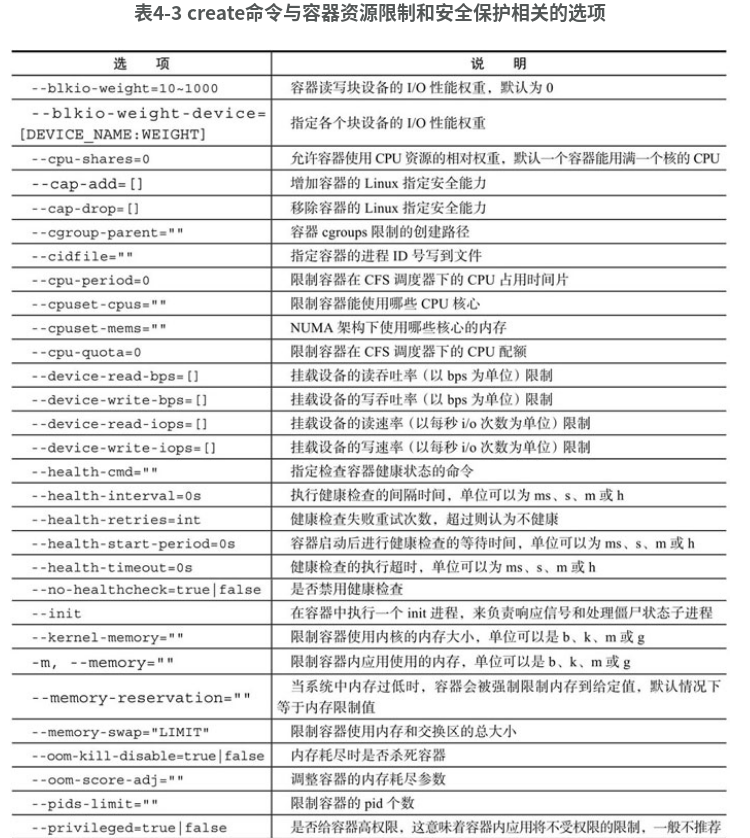

# Docker 基础 -- 镜像

​	镜像是静态的只读文件，而容器带有运行时需要的可写文件层，同时，容器中的应用进程处于运行状态。

### 创建容器

```sh
# 新建容器，新建的容器处于停止状态
docker [container] create
docker create -it ubuntu:latest

# 启动容器
docker [container] start ID
docker start af

# 查看容器
docker ps
docker container  ls

# 新建并启动容器
docker [container] run
docker run ubuntu /bin/echo 'Hello world'
```








当利用`docker [container] run`来创建并启动容器时，Docker在后台运行的标准操作包括：

❑ 检查本地是否存在指定的镜像，不存在就从公有仓库下载；

❑ 利用镜像创建一个容器，并启动该容器；

❑ 分配一个文件系统给容器，并在只读的镜像层外面挂载一层可读写层；

❑ 从宿主主机配置的网桥接口中桥接一个虚拟接口到容器中去；

❑ 从网桥的地址池配置一个IP地址给容器；

❑ 执行用户指定的应用程序；

❑ 执行完毕后容器被自动终止。

```sh
docker run -it ubuntu:18.04 /bin/bash
```

​	其中，`-t`选项让Docker分配一个伪终端（pseudo-tty）并绑定到容器的标准输入上，`-i`则让容器的标准输入保持打开。更多的命令选项可以通过`man docker-run`命令来查看。

#### 守护态运行	

​	更多的时候，需要让Docker容器在后台以守护态（Daemonized）形式运行。此时，可以通过添加-d参数来实现。

```sh
docker run -d ubuntu /bin/sh -c "while true; do echo hello world; sleep 1;done"
```

#### 查看容器输出

```sh
docker [container] logs CONTAINER
```

该命令支持的选项包括：

❑ -details：打印详细信息；

❑ -f, -follow：持续保持输出；

❑ -since string：输出从某个时间开始的日志；

❑ -tail string：输出最近的若干日志；

❑ -t, -timestamps：显示时间戳信息；

❑ -until string：输出某个时间之前的日志。

### 停止容器

pause/unpause, stop, prune

#### 暂停容器

​	可以使用`docker [container] pause CONTAINER [CONTAINER...]`命令来暂停一个运行中的容器。

​	处于paused状态的容器，可以使用`docker [container] unpause CONTAINER [CONTAINER...]`命令来恢复到运行状态。

#### 终止容器

​	可以使用`docker[container] stop [-t|--time[=10]] [CONTAINER...]`来终止一个运行中的容器。该命令会首先向容器发送SIGTERM信号，等待一段超时时间后（默认为10秒），再发送SIGKILL信号来终止容器：

​	此时，执行`docker container prune`命令，会自动清除掉所有处于停止状态的容器。

​	此外，还可以通过`docker [container] kill`直接发送SIGKILL信号来强行终止容器。

​	用`docker ps -qa`命令看到所有容器的ID。

​	处于终止状态的容器，可以通过`docker [container] start`命令来重新启动

​	`docker [container] restart`命令会将一个运行态的容器先终止，然后再重新启动

