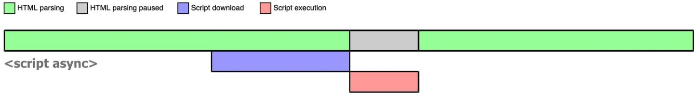
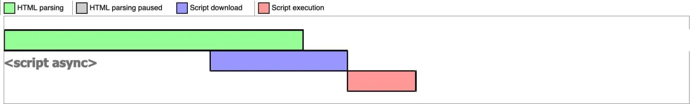
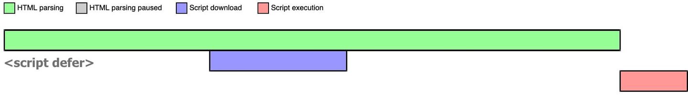

# script
浏览器在解析 HTML 的时候，如果遇到一个没有任何属性的 [script](https://developer.mozilla.org/zh-CN/docs/Web/HTML/Element/script) 标签，就会暂停解析，先发送网络请求获取该 JS 脚本的代码内容，然后让 JS 引擎执行该代码，当代码执行完毕后恢复解析。
script 阻塞了浏览器对 HTML 的解析，如果获取 JS 脚本的网络请求迟迟得不到响应，或者 JS 脚本执行时间过长，都会导致白屏，用户看不到页面内容。

## async
> 对于普通脚本，如果存在 async 属性，那么普通脚本会被并行请求，并尽快解析和执行。

> 对于模块脚本，如果存在 async 属性，那么脚本及其所有依赖都会在延缓队列中执行，因此它们会被并行请求，并尽快解析和执行。

当浏览器遇到带有 async 属性的 script 时，请求该脚本的网络请求是***异步***的，不会阻塞浏览器解析 HTML，一旦网络请求回来之后，如果此时 HTML 还没有解析完，浏览器会暂停解析，先让 JS 引擎执行代码，执行完毕后再进行解析，图示如下：

如果在 JS 脚本请求回来之前，HTML 已经解析完毕了，那就立即执行 JS 代码，如下图所示：

async 是不可控的，因为执行时间不确定，你如果在异步 JS 脚本中获取某个 DOM 元素，有可能获取到也有可能获取不到。而且如果存在多个 async 的时候，它们之间的执行顺序也不确定，完全依赖于网络传输结果，谁先到执行谁。

## defer
`defer` 向浏览器表明，该脚本是要在文档被解析后，但在触发 **DOMContentLoaded** 事件之前执行的。
当浏览器遇到带有 defer 属性的 script 时，获取该脚本的网络请求也是异步的，***不会阻塞***浏览器解析 HTML，一旦网络请求回来之后，如果此时 HTML 还没有解析完，浏览器不会暂停解析并执行 JS 代码，而是等待 HTML 解析完毕再执行 JS 代码，图示如下：

如果存在多个 defer script 标签，浏览器（IE9及以下除外）会保证它们按照在 HTML 中出现的顺序执行，不会破坏 JS 脚本之间的依赖关系。

> 模块脚本默认是 defer 的。
