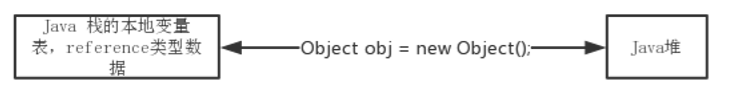
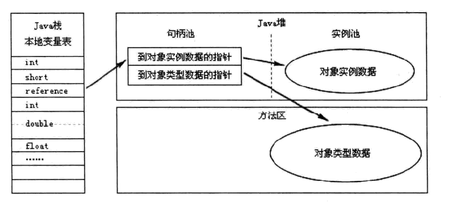
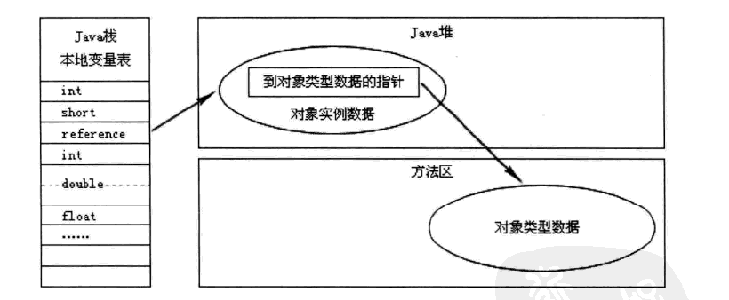

# Java 内存区域

## 运行时数据区

Java 虚拟机所管理的内存包括 `方法区`、`虚拟机栈`、`本地方法栈`、`堆`、`程序计数器` 这几个运行时数据区域。

线程私有：各线程之间的互不影响，独立存储。

- 程序计数器(Program Counter Register)：可以看作当前线程所执行的字节码的行号指示器。每条线程都需要有一个独立的程序计数器，线程私有。

- Java虚拟机栈(JVM Stacks)：生命周期与线程相同，描述的是 Java 方法执行的内存模型：每个方法执行的时候都会同时创建一个栈帧，用于存储局部变量表、操作栈、动态链接、方法出口等信息。线程私有，为虚拟机执行 Java 方法（字节码）服务。

   - 局部变量表中64位长度的`long`和`double`类型的数据会占据2个局部变量空间，其余的数据类型只占用1个，在编译时确定大小，运行时不可修改

   - 异常：1. 线程请求的栈深度大于虚拟机允许的深度，抛出`StackOverflowError`

     ​		  2. 动态拓展的虚拟机栈无法申请到足够的内存时会抛出`OutOfMemoryError`异常

- 本地方法栈(Native Method Stacks)：类似虚拟机栈，为 Native 方法服务。

- Java 堆(Heap)：线程共享。目的是存放对象实例，几乎所有的对象实例在堆上分配内存，也是垃圾收集器的主要区域。如果在堆中没有内存完成实例分配，并且堆也无法再拓展时，会抛出`OutOfMemoryError`异常。

- 方法区(Method Area)：线程共享。用于存储已被虚拟机加载的类信息、常量、静态变量、即时编译器编译后的代码等数据。当方法区无法满足内存分配需求时，会抛出`OutOfMemoryError`异常。

  	- 运行时常量池(Runtime Constant Pool)：方法区的一部分。在Class文件中有常量池的描述信息，用于存放编译初期生成的各种字面量和符号引用，这部分内容将在类加载后存放到方法区的运行时常量池中。具备动态性，运行期间也可能将新的常量放入池中，比如`String`类的`intern`方法。

- 直接内存(Direct Memory)：在 `JDK` 1.4中新加入了NIO (New Input/Output) 类，引入了一种基于通道(channel) 与缓冲区(Buffer) 的 I/O 方式，它可以使用 Native 函数库直接分配堆外内存，然后通过一个存储在Java堆里面的 DirectByteBuffer 对象作为这块内存的引用进行操作。这样避免了在Java堆和Native堆中来回复制数据，在一些场景中能显著提高性能。在各个内存区域的总和大于物理内存限制时，会导致动态拓展时出现`OutOfMemoryError`异常。


## 对象访问

```java
Object obj = new Object();
```



​	在 Java 堆中还必须包括能查找到此对象类型数据（如对象类型、父类、实现的接口、方法等）的地址信息，这些信息则存储在方法区中。

​	reference 类型：一个指向对象的引用，主流的访问方式有 `使用句柄`和`直接指针`。

 - 使用句柄：reference 中保存的就是对象的句柄地址，句柄池中句柄包含了对象实例数据和类型数据各自的具体地址信息。

   

	- 直接指针：

