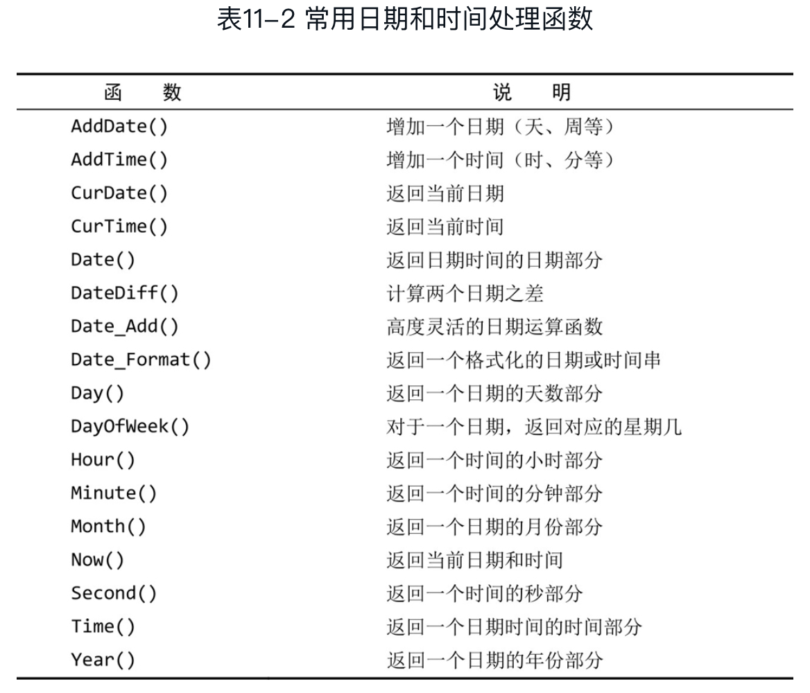

# Mysql 
### 正则表达式

正则表达式区分大小写 REGEXP BINARY:

```sql
SELECT * FROM XX WHERE FIELD REGEXP BINARY 'Sample|As|[SM]';
```

转义：

```
\\. 匹配.
\\n 匹配换行
\\r 匹配回车
\\\ 匹配\
```


​	可以在不使用数据库表的情况下用SELECT来测试正则表达式。REGEXP检查总是返回0（没有匹配）或1（匹配）。可以用带文字串的REGEXP来测试表达式，并试验它们。相应的语法如下：

```sql
SELECT 'hello' REGEXP '[0-9]';
```


### 数据处理函数

省略 FROM 子句测试表达式

```sql
SELECT Trim('abc')；
```

#### 1. 文本处理函数

拼接字段 Concat()，别名 AS

```sql
SELECT Concat(name, '(', address, ')') AS title FROM user;
```

去除空格 RTrim(), LTrim(), Trim()

```sql
SELECT Trim(name) FROM user;
```

转换大写 Upper()

```sql
SELECT Upper(name) FROM user;
```


#### 2. 日期和时间处理函数



日期格式为 yyyy-mm-dd

```sql
SELECT name FROM orders WHERE Year(order_date) = 2020 AND Month(order_date) = 9;
```

#### 3. 数值处理函数


### 数据汇总函数


*AVG、MAX、MIN、SUM函数忽略列值为$NULL的行*

COUNT(*) 对表中行的数目进行计数，包含NULL值；COUNT(column) 对特定列中有值的行计数，忽略NULL值。

DISTINCT 必须使用列名

```sql
SELECT AVG(DISTINCT price) AS avg_price FROM product;
```


### 数据分组

**GROUP**: 分组允许把数据分为多个逻辑组，以便能**对每个组**进行聚集计算。

```sql
SELECT vender_id, COUNT(*) AS num_prods FROM products GROUP BY vender_id;
```

- GROUP BY 子句可以包含任意数目的列
- 除聚集计算语句外，SELECT语句中的每个列都必须在GROUP BY子句中给出。
- 如果分组列中具有NULL值，则NULL将作为一个分组返回。如果列中有多行NULL值，它们将分为一组。
- WITH ROLLUP 返回分组汇总之后的值

```sql
SELECT coalesce(name, '总金额'), SUM(money) AS money FROM products GROUP BY name WITH ROLLUP;
```

**HAVING** 支持所有 WHERE 操作符，规定包括哪些分组，排除哪些分组

```sql
SELECT cust_id, COUNT(*) AS orders 
FROM orders 
WHERE prod_price >= 10
GROUP BY cust_id 
HAVING COUNT(*) >= 2
ORDER BY orders
```

​	WHERE 在数据分组前进行过滤，HAVING 在数据分组后进行过滤。


### 子查询

嵌套在其他查询中的查询，不要嵌套太多子查询

1. 子查询作为条件

```sql
SELECT cust_name 
FROM customers
WHERE cust_id IN (SELECT cust_id 
                  FROM orders
                 	WHERE order_num IN (SELECT order_num
                                      FROM orderitems
                                      WHERE prod_id = 'APPLE'));
```

2. 子查询作为计算字段

```sql
SELECT cust_name, 
			 cust_state, 
			 (SELECT COUNT(*) FROM orders WHERE orders.cust_id = customers.cust_id) AS orders
FROM customers
ORDER BY cust_name;
```


### 联结 JOIN

外键为某个表中的一列，包含另一个表的主键值，定义了两个表之间的关系。

```sql
SELECT vend_name, prod_name, prod_price
FROM venders, products
WHERE venders.vender_id = products.vender_id
ORDER BY vender_name, prod_name;
```

```sql
SELECT vend_name, prod_name, prod_price
FROM venders INNER JOIN products
ON venders.vender_id = products.vender_id
ORDER BY vender_name, prod_name;
```

减少不必要的联结，联结的表越多，性能下降越厉害。

```sql
SELECT cust_name
FROM customers AS c, orders AS o, orderitems AS oi
WHERE c.cust_id = o.cust_id
	AND oi.order_num = o.order_num
	AND prod_id = 'APPLE';
```

自联结

```sql
SELECT p1.prod_id, p1.prod_name
FROM products AS p1, products AS p2
WHERE p1.vender_id = p2.vender_id
	AND p2.prod_id = 'XXX'
```

外部联结

```sql
SELECT vend_name, COUNT(products.prod_id)
FROM venders LEFT OUTER JOIN products
ON venders.vender_id = products.vender_id
GROUP BY venders.vender_id
ORDER BY vender_name;
```

### 组合查询

- 在单个查询中从不同的表返回类似结构的数据
- 对单个表执行多个查询，按单个查询返回数据

多数情况下，结合相同表的两个查询完成的工作与具有多个where子句条件的单条查询完成的工作相同。

```sql
SELECT vender_id, prod_id, prod_price
FROM products
WHERE prod_id <= 5
UNION
SELECT vender_id, prod_id, prod_price
FROM products
WHERE vender_id IN (1001, 1002)
ORDER BY vender_id, prod_price
```

```sql
SELECT vender_id, prod_id, prod_price
FROM products
WHERE prod_id <= 5
	OR vender_id IN (1001, 1002)
ORDER BY vender_id, prod_price
```

​	UNION 中每个查询必须包含相同的列、表达式或聚集函数（次序不需要相同）；类数据类型必须兼容但不必相同。

​	UNION 从查询结果中自动去除了重复的行，使用 *UNION ALL* 返回所有匹配行。


### 全文搜索

​	mysql 最常用的引擎中，MyISAM支持全文搜索，InnoDB不支持。

​	为了进行全文本索引，必须索引被搜索的列，而且要随着数据的改变不断地重新索引。在对列表进行适当设计后，Mysql会自动进行所有的索引和重新索引。在索引之后，SELECT 可与 Match() 和 Against() 一起使用以实际执行搜索。

​	创建表时启用全文本搜索，CREATE TABLE 语句接收 FULLTEXT 子句，它给出被索引的一个逗号分隔的列表。

```sql
CREATE TABLE productnotes
(
	note_id		int				NOT NULL 	AUTO_INCREMENT,
  prod_id 	char(10) 	NOT NULL,
  note_date	datetime	NOT NULL,
  note_text	text			NULL,
  PRIMARY KEY(note_id),
  FULLTEXT(note_text)
)	ENGINE=MyISAM;
```

​	Match() 函数指定被搜索的列，Against() 函数指定要使用的搜索表达式；返回以文本匹配的良好程度排序的数据，等级由 MYSQL 根据行中词的数目、唯一词的数目、整个索引中词的总数以及包含该词的行的数目计算出来。

```sql
SELECT note_text, 
			 Match(note_text) Against('rabbit') AS rank
FROM productnotes;
```

```sql
SELECT note_text
FROM productnotes
WHERE Match(note_text) Against('rabbit');
```

​	除非使用BINARY，否则全文本搜索不区分大小写。Match() 的值必须与FULLTEXT 定义中的相同。

​	效果与下面语句相同：

```sql
SELECT note_text
FROM productnotes
WHERE note_text LIKE '%rabbit%';
```

#### 查询拓展（version>=4.1.1）

- 首先，进行一个基本的全文本搜索，找出与搜索条件匹配的所有行
- 其次，MYSQL 检查这些匹配行并选择所有有用的词
- 最后，MYSQL 再次进行全文本搜索，使用所有有用的词

表中的行越多，查询拓展返回的结果越好。

```sql
// 只返回包含 anvils 的行
SELECT note_text
FROM productionnotes
WHERE Match(note_text) Against('anvils');
```

```sql
// 查询拓展
SELECT note_text
FROM productionnotes
WHERE Match(note_text) Against('anvils' WITH QUERY EXPANSION);
```

#### 布尔文本搜索

- 要匹配的词
- 要排斥的词
- 排列提示
- 表达式分组等

布尔文本搜索是非常缓慢的操作，即使没有定义 FULLTEXT 也可以使用。

```sql
// 包含 anvils
SELECT note_text
FROM productionnotes
WHERE Match(note_text) Against('anvils' IN BOOLEAN MODE);
```

```sql
// 包含 (可选)anvils 和 (必选)heavy，增加前者的等级，降低后者的等级，排除rope开始的词
SELECT note_text
FROM productionnotes
WHERE Match(note_text) Against('>anvils +(<heavy) -rope*' IN BOOLEAN MODE);
```


#### 重要说明

- 索引全文本数据时，短词被忽略且从索引中排除。短词定义为那些具有3个或3个以下字符的词，数目可更改
- MYSQL 自带一个内建的停用词列表，这些词在索引全文本数据时总是被忽略，如果需要，可以覆盖
- 许多词出现的频率很高，搜索他们没有用处，因此，MYSQL 规定了一条50%规则，如果一个词出现在50%以上的行中，则将它作为一个停用词忽略。50%规则不用于 IN BOOLEAN MODE
- 如果表中的行数少于3行，则全文本搜索不返回结果（因为每个词或者不出现，或者至少出现在50%的行中）
- 忽略词中的单引号
- 不具有词分隔符的语言不能恰当地反回全文本搜索结果，比如汉语
- 仅MyISAM引擎支持全文本搜索


### 插入数据

```sql
INSERT INTO customers(
                      cust_name,
                      cust_city)
VALUES('a', 'shanghai')
```

insert select 

```sql
INSERT INTO customers(cust_id,
                      cust_name,
                      cust_city)
SELECT cust_id,
	cust_name,
	cust_city
FROM custnew;
```

​	为简单起见，这个例子在INSERT和SELECT语句中使用了相同的列名。但是，不一定要求列名匹配。事实上，MySQL甚至不关心SELECT返回的列名。它使用的是列的位置，因此SELECT中的第一列（不管其列名）将用来填充表列中指定的第一个列，第二列将用来填充表列中指定的第二个列，如此等等。这对于从使用不同列名的表中导入数据是非常有用的。

### 更新数据

#### UPDATE

基本的UPDATE语句由3部分组成，分别是：

❑ 要更新的表；

❑ 列名和它们的新值；

❑ 确定要更新行的过滤条件。

```sql
UPDATE customers
SET cust_email = 'a@163.com',
		cust_name = 'Fudds'
WHERE cust_id = 1005;
```

​	即使是发生错误，也继续进行更新，可使用IGNORE关键字，如下所示：

```sql
UPDATE IGNORE customers…
```

#### DELETE

```sql
DELETE FROM customers WHERE cust_id = 1006;
```

​	如果想从表中删除所有行，不要使用DELETE。可使用TRUNCATE TABLE语句，它完成相同的工作，但速度更快（TRUNCATE实际是删除原来的表并重新创建一个表，而不是逐行删除表中的数据）。

​	使用强制实施引用完整性的数据库(外键)，**这样MySQL将不允许删除具有与其他表相关联的数据的行**。


### 创建和操纵表

表的创建、更改、删除

#### 创建表

至少包含名字和列的细节

```sql
CREATE TABLE customers IF NOT EXISTS
(
	cust_id int 						NOT NULL AUTO_INCREMENT,
	cust_name char(50) 		NOT NULL,
    cust_address char(50) NULL,
    cust_level level 				NOT NULL DEFAULT 1,
    PRIMARY KEY (cust_id)
) ENGINE=innerDB;
```

​	IF NOT EXISTS 查看表名是否存在，并且仅在表名不存在时创建它。

​	表中的每个行必须具有**唯一**的主键值。如果主键使用单个列，则它的值必须唯一。如果使用多个列，则这些列的组合值必须唯一。允许NULL值的列不能作为唯一标识。

> PRIMARY KEY (order_num, order_item)

​	AUTO_INCREMENT，本列每当增加一行时自动增量，**每个表只允许一个AUTO_INCREMENT列，而且它必须被索引**。在 insert 时指定值可以覆盖 AUTO_INCREMENT ，后续的增量将基于该值。

```sql
// 返回最后一个AUTO_INCREMENT值
SELECT last_insert_id();
```

##### 引擎

❑ InnoDB是一个可靠的事务处理引擎，它不支持全文本搜索；

❑ MyISAM是一个性能极高的引擎，它支持全文本搜索，但不支持事务处理。

❑ MEMORY在功能等同于MyISAM，但由于数据存储在内存（不是磁盘）中，速度很快（特别适合于临时表）；

​	混用引擎类型有一个大缺陷。外键（用于强制实施引用完整性）不能跨引擎，即使用一个引擎的表不能引用具有使用不同引擎的表的外键。

#### 更新表

```sql
ALTER TABLE venders
ADD vender_phone CHAR(20);
```

```sql
ALTER TABLE venders
DROP COLUMN vender_phone;
```

```sql
// 增加外键
ALTER TABLE orderitems
ADD CONSTRAINT fk_orderitems_orders 
FOREIGN KEY (order_num) REFERENCES orders (order_num);
```

#### 删除表

```sql
DROP TABLE cumstomers;
```

#### 重命名表

```sql
RENAME TABLE cumstomers2 TO cumstomers;
```


### 视图

​	视图是虚拟的表，与包含数据的表不一样，视图只包含使用时动态检索的查询。

```sql
SELECT cust_name, cust_contact
FROM customers AS c, orders AS o, orderitems AS oi
WHERE c.cust_id = o.cust_id
	AND oi.order_num = o.order_num
	AND prod_id = 'APPLE';
```

```sql
// productcustomers 是视图
SELECT cust_name, cust_contact
FROM productcustomers
WHERE prod_id = 'APPLE';
```

下面是视图的一些常见应用。

❑ 重用SQL语句。

❑ 简化复杂的SQL操作。在编写查询后，可以方便地重用它而不必知道它的基本查询细节。

❑ 使用表的组成部分而不是整个表。

❑ 保护数据。可以给用户授予表的特定部分的访问权限而不是整个表的访问权限。

❑ 更改数据格式和表示。视图可返回与底层表的表示和格式不同的数据。

> 因为视图不包含数据，所以每次使用视图时，都必须处理查询执行时所需的任一个检索。如果你用多个联结和过滤创建了复杂的视图或者嵌套了视图，可能会发现性能下降得很厉害。因此，在部署使用了大量视图的应用前，应该进行测试。

#### 创建

❑ 视图用CREATE VIEW语句来创建。

❑ 使用SHOW CREATE VIEW viewname；来查看创建视图的语句。

❑ 用DROP删除视图，其语法为DROP VIEW viewname;。

❑ 更新视图时，可以先用DROP再用CREATE，也可以直接用CREATE OR REPLACEVIEW。如果要更新的视图不存在，则第2条更新语句会创建一个视图；如果要更新的视图存在，则第2条更新语句会替换原有视图。

#### 使用

##### 隐藏复杂的SQL

视图的最常见的应用之一是隐藏复杂的SQL，这通常都会涉及联结。

```sql
CREATE VIEW productcustomers AS
SELECT cust_name, cust_contact, prod_id
FROM customers, orders, orderitems
WHERE customers.cust_id = orders.cust_id
	AND orderitems.order_num = orders.order_num;
```

```sql
SELECT cust_name, cust_contact
FROM productcustomers
WHERE prod_id = 'APPLE';
```

创建不受特定数据限制的视图是一种好办法。

##### 格式化检索出的数据

```sql
CREATE VIEW venderlocation AS
SELECT Concat(RTrim(vender_name), '(', RTrim(vender_contry), ')') 
				AS vend_title
FROM venders
ORDER BY vender_name;
```

##### 过滤不想要的数据

```sql
CREATE VIEW cu stomeremaillist AS
SELECT cust_id, cust_name, cust_email
FROM customers
WHERE cust_email IS NOT NULL;
```

#### 更新

​	通常，视图是可更新的（即，可以对它们使用INSERT、UPDATE和DELETE）。更新一个视图将更新其基表。如果你对视图增加或删除行，实际上是对其基表增加或删除行。

​	但是，并非所有视图都是可更新的。基本上可以说，如果MySQL不能正确地确定被更新的基数据，则不允许更新（包括插入和删除）。这实际上意味着，如果视图定义中有以下操作，则不能进行视图的更新：

❑ 分组（使用GROUP BY和HAVING）；

❑ 联结；

❑ 子查询；

❑ 并；

❑ 聚集函数（Min()、Count()、Sum()等）；

❑ DISTINCT；

❑ 导出（计算）列。

**视图主要用于数据检索**


### 存储过程

存储过程简单来说，就是为以后的使用而保存的一条或多条MySQL语句的集合，简单、安全、高性能。

❑ 通过把处理封装在容易使用的单元中，简化复杂的操作。

❑ 由于不要求反复建立一系列处理步骤，这保证了数据的完整性。如果所有开发人员和应用程序都使用同一（试验和测试）存储过程，则所使用的代码都是相同的。这一点的延伸就是防止错误。需要执行的步骤越多，出错的可能性就越大。防止错误保证了数据的一致性。

❑ 简化对变动的管理。如果表名、列名或业务逻辑（或别的内容）有变化，只需要更改存储过程的代码。使用它的人员甚至不需要知道这些变化。

❑ 提高性能。因为使用存储过程比使用单独的SQL语句要快。

❑ 存在一些只能用在单个请求中的MySQL元素和特性，存储过程可以使用它们来编写功能更强更灵活的代码

#### 执行

CALL接受存储过程的名字以及需要传递给它的任意参数。

```sql
CALL productpricing(
	@pricelow,
	@pricehigh,
	@priceaverage
)
```

#### 创建

```sql
CREATE PROCEDURE productpricing()
BEGIN
	SELECT Avg(prod_price) AS priceaverage
	FROM products;
END
```

​	此存储过程名为productpricing，用`CREATE PROCEDURE productpricing()`语句定义。如果存储过程接受参数，它们将在()中列举出来。此存储过程没有参数，但后跟的()仍然需要。BEGIN和END语句用来限定存储过程体，过程体本身仅是一个简单的SELECT语句。

```sql
DELIMITER //
CREATE PROCEDURE productpricing()
BEGIN
	SELECT Avg(prod_price) AS priceaverage
	FROM products;
END //
DELIMITER ;
```

​	其中，`DELIMITER //`告诉命令行实用程序使用//作为新的语句结束分隔符，可以看到标志存储过程结束的END定义为END//而不是END;。这样，存储过程体内的；仍然保持不动，并且正确地传递给数据库引擎。最后，为恢复为原来的语句分隔符，可使用DELIMITER ;。

```sql
CALL productpricing();
```

#### 删除

```sql
# 请注意没有使用后面的()，只给出存储过程名。
DROP PROCEDURE IF EXISTS productpricing;
```

#### 使用参数

​	MySQL支持IN（传递给存储过程）、OUT（从存储过程传出）和INOUT（对存储过程传入和传出）类型的参数。

```sql
CREATE PROCEDURE ordertotal(
	IN 	onumber INT,
	OUT total 	DECIMAL(8,2)
)
BEGIN
	-- 注释SELECT
	SELECT Sum(item*quantity) INTO total
	FROM orderitems
	WHERE order_num = onumber;
END
```

​	存储过程的代码位于BEGIN和END语句内，如前所见，它们是一系列SELECT语句，用来检索值，然后保存到相应的变量（通过指定INTO关键字）。

```sql
CALL ordertotal(
	20005,
	@total
);
SELECT @total;
```

> 所有MySQL变量都必须以@开始。

```sql
CREATE PROCEDURE ordertotal(
	IN 	onumber INT,
	IN  taxable BOOLEAN,
	OUT ototal 	DECIMAL(8,2)
) COMMENT 'order total with tax'
BEGIN
	-- Declare
	DECLARE total DECIMAL(8,2);
	DECLARE taxrate INT DEFAULT 6;
	
	-- Select
	SELECT Sum(item*quantity) INTO total
	FROM orderitems
	WHERE order_num = onumber;
	
	-- tax?
	IF taxable THEN
		SELECT total+(total/100*taxrate) INTO total;
  ELSEIF .. THEN
  	..
  ELSE
  	..
  END IF;
  
  SELECT total INTO ototal;
END
```

​	DECLARE要求指定变量名和数据类型，它也支持可选的默认值。

​	COMMENT 值将在 `SHOW PROCEDURE STATUS LIKE '...'`（获取何时、由谁创造等具体信息） 的结果中显示。

​	BOOLEAN值指定为非零值表示真，指定为0表示假。


### 游标

游标（cursor）是一个存储在MySQL服务器上的数据库查询，它不是一条SELECT语句，而是被该语句检索出来的结果集。在存储了游标之后，应用程序可以根据需要滚动或浏览其中的数据。MySQL游标只能用于存储过程（和函数）

使用游标涉及几个明确的步骤。

❑ 在能够使用游标前，必须声明（定义）它。这个过程实际上没有检索数据，它只是定义要使用的SELECT语句。

❑ 一旦声明后，必须打开游标以供使用。这个过程用前面定义的SELECT语句把数据实际检索出来。

❑ 对于填有数据的游标，根据需要取出（检索）各行。

❑ 在结束游标使用时，必须关闭游标。

在声明游标后，可根据需要频繁地执行取操作、打开和关闭游标。

在一个游标被打开后，可以使用`FETCH`语句分别访问它的每一行（自动从第一行开始）。`FETCH`指定检索什么数据（所需的列），检索出来的数据存储在什么地方。它还向前移动游标中的内部行指针，使下一条`FETCH`语句检索下一行（不重复读取同一行）。

存储过程处理完成后，游标就消失（因为它局限于存储过程）。

```sql
CREATE PROCEDURE processorders()
BEGIN
	DECLARE done BOOLEAN DEFAULT 0; 
	DECLARE o INT;
	DECLARE t DECIMAL(8, 2);

	-- 定义游标
	DECLARE ordernumbers CURSOR
	FOR
	SELECT order_num FROM orders;
	
	-- 这条语句定义了一个CONTINUE HANDLER，它是在条件出现时被执行的代码。这里，它指出当SQLSTATE '02000’出现时，SET done=1。SQLSTATE '02000’是一个未找到条件，当REPEAT由于没有更多的行供循环而不能继续时，出现这个条件。
	DECLARE CONTINUE HANDLER FOR SQLSTATE '02000' SET done=1;
	
	-- store table
	CREATE TABLE IF NOT EXISTS ordertotals (order_num INT, total DECIMAL(8, 2));
	
	OPEN ordernumbers;
	
	REPEAT
		FETCH ordernumbers INTO o;
		-- get total into t
		CALL ordertotals(o, 1, t);
		INSERT INTO ordertotals(order_num, total) VALUES(o, t);
		-- other ...
	UNTIL done END REPEAT
	
	CLOSE ordernumbers;
END
```

用DECLARE语句定义的局部变量必须在定义任意游标或句柄之前定义，而句柄必须在游标之后定义。


### 触发器

触发器是MYSQL响应以下任意语句而自动执行的一条MYSQL语句（或位于BEGIN和END语句之间的一组语句）：

❑ DELETE；❑ INSERT；❑ UPDATE。

#### 创建触发器

在创建触发器（只有表才支持触发器，视图不支持）时，需要给出4条信息：

❑ 唯一的触发器名；

❑ 触发器关联的表；

❑ 触发器应该响应的活动（DELETE、INSERT或UPDATE）；

❑ 触发器何时执行（处理之前或之后）。

```sql
CREATE TRIGGER newproduct AFTER INSERT ON products
FOR EACH ROW SELECT 'Product added';
```

触发器按每个表每个事件每次的定义，每个表每个事件每次只允许一个触发器，因此，每个表最多支持6个触发器（每条INSERT、UPDATE和DELETE的之前和之后），一个触发器对应一个事件。

> 如果 BEFORE 触发器失败，则MySQL 将不执行请求的操作以及AFTER触发器。

#### 删除触发器

```sql
DROP TRIGGER newproduct;
```

触发器不能更新或覆盖，要修改一个触发器，必须先删除它，然后重新创建。

#### INSERT 触发器

❑ 在INSERT触发器代码内，可引用一个名为NEW的虚拟表，访问被插入的行；

❑ 在BEFORE INSERT触发器中，NEW中的值也可以被更新（允许更改被插入的值）；

❑ 对于AUTO_INCREMENT列，NEW在INSERT执行之前包含0，在INSERT执行之后包含新的自动生成值。

```sql
CREATE TRIGGER neworder AFTER INSERT ON orders
FOR EACH ROW SELECT NEW.order num;
```

> 通常，将 BEFORE 用于数据验证和净化，保证插入表中的数据是正确的

#### DELETE 触发器

❑ 在DELETE触发器代码内，你可以引用一个名为OLD的虚拟表，访问被删除的行；

❑ OLD中的值全都是只读的，不能更新。

```sql
CREATE TRIGGER deleteorder BEFORE DELETE ON orders
FOR EACH ROW
BEGIN
	-- 标记触发体
	INSERT INTO archive_orders(order_num, order_date, cust_id)
	VALUES(OLD.order_num, OLD.order_date, OLD.cust_id);
END;
```

#### UPDATE 触发器

❑ 在UPDATE触发器代码中，你可以引用一个名为OLD的虚拟表访问以前（UPDATE语句前）的值，引用一个名为NEW的虚拟表访问新更新的值；

❑ 在BEFORE UPDATE触发器中，NEW中的值可能也被更新（允许更改将要用于UPDATE语句中的值）；

❑ OLD中的值全都是只读的，不能更新。

```sql
CREATE TRIGGER updatevender BEFORE UPDATE ON venders
FOR EACH ROW SET NEW.vend_stat = Upper(NEW.vend_stat);
```

#### TIPS

❑ 与其他DBMS相比，MySQL 5中支持的触发器相当初级。未来的MySQL版本中有一些改进和增强触发器支持的计划。

❑ 创建触发器可能需要特殊的安全访问权限，但是，触发器的执行是自动的。如果INSERT、UPDATE或DELETE语句能够执行，则相关的触发器也能执行。

❑ 应该用触发器来保证数据的一致性（大小写、格式等）。在触发器中执行这种类型的处理的优点是它总是进行这种处理，而且是透明地进行，与客户机应用无关。

❑ 触发器的一种非常有意义的使用是创建审计跟踪。使用触发器，把更改（如果需要，甚至还有之前和之后的状态）记录到另一个表非常容易。

❑ 遗憾的是，MySQL触发器中不支持CALL语句。这表示不能从触发器内调用存储过程。所需的存储过程代码需要复制到触发器内。

### 管理事务处理

​	事务处理（transaction processing）可以用来维护数据库的完整性，保证成批的MySQL操作要么完全执行，要么完全不执行。

❑ 事务（transaction）指一组SQL语句；

❑ 回退（rollback）指撤销指定SQL语句的过程；

❑ 提交（commit）指将未存储的SQL语句结果写入数据库表；

❑ 保留点（savepoint）指事务处理中设置的临时占位符（place-holder），你可以对它发布回退（与回退整个事务处理不同）。

#### ROLLBACK

```sql
SELECT * FROM ordertotals;
START TRANSACTION;
DELETE FROM ordertotals;
SELECT * FROM ordertotals;
-- ROLLBACK 只能在一个事务处理内使用
ROLLBACK;
SELECT * FROM ordertotals;
```

#### COMMIT

> 隐含提交，提交操作是自动进行的，一般的MySQL语句都是隐含提交的

在事务处理块中，必须使用 COMMIT 明确地提交。

```sql
START TRANSACTION;
DELETE FROM ordertotals WHERE order_num = 20010;
COMMIT;
```

当 COMMIT 或 ROLLBACK 语句执行后，事务将自动关闭。

#### 保留点

​	保留点是占位符，支持回退部分事务处理。每个保留点都取标识它的唯一名字，以便在回退时，MySQL知道要回退到何处。

```sql
SAVEPOINT delete1;
...
ROLLBACK TO delete1;
```

> 保留点在事务处理完成（执行一条ROLLBACK或COMMIT）后自动释放，也可以用RELEASE SAVEPOINT明确地释放保留点。

#### 更改默认的提交行为

为指示MySQL不自动提交更改，需要使用以下语句：

```sql
-- 0 为假
SET autocommit=0;
```

> autocommit标志是针对每个连接而不是服务器的。


### 全球化和本地化

